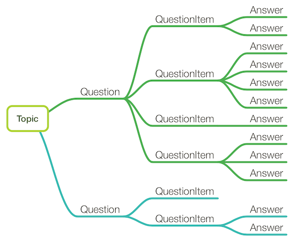

## 目录结构

```
main
├── java
│   └── com
│       └── xtuer
│           ├── bean
│           │   ├── Answer.java
│           │   ├── Gift.java
│           │   ├── Participant.java
│           │   ├── ParticipantGift.java
│           │   ├── Question.java
│           │   ├── QuestionItem.java
│           │   ├── Result.java
│           │   └── Topic.java
│           ├── controller
│           │   ├── CommonController.java
│           │   ├── GiftController.java
│           │   ├── LoginController.java
│           │   ├── ParticipantController.java
│           │   ├── QuestionController.java
│           │   ├── SurveyController.java
│           │   ├── TopicController.java
│           │   └── UriViewConstants.java
│           ├── exception
│           │   └── XTuerHandlerExceptionResolver.java
│           ├── interceptor
│           │   └── JsonpInterceptor.java
│           ├── mapper
│           │   ├── AnswerMapper.java
│           │   ├── ParticipantGiftMapper.java
│           │   ├── ParticipantMapper.java
│           │   ├── QuestionItemMapper.java
│           │   ├── QuestionMapper.java
│           │   └── TopicMapper.java
│           ├── service
│           │   ├── GiftService.java
│           │   ├── ParticipantService.java
│           │   ├── QuestionService.java
│           │   ├── SurveyService.java
│           │   └── TopicService.java
│           └── util
│               ├── RegularExpressionPattern.java
│               ├── SecurityUtils.java
│               └── SessionUtils.java
├── resources
│   ├── config
│   │   ├── application.properties
│   │   ├── application.xml
│   │   ├── mybatis.xml
│   │   ├── spring-mvc.xml
│   │   ├── spring-security.xml
│   │   ├── spring-transaction.xml
│   │   └── spring-view-controller.xml
│   ├── logback.xml
│   └── mapper
│       ├── Answer.xml
│       ├── Participant.xml
│       ├── ParticipantGift.xml
│       ├── Question.xml
│       ├── QuestionItem.xml
│       └── Topic.xml
└── webapp
    └── WEB-INF
        ├── asset
        │   ├── css
        │   │   ├── admin-common.css
        │   │   ├── editor.css
        │   │   ├── fortune-wheel.css
        │   │   └── login.css
        │   ├── img
        │   │   └── favicon.ico
        │   ├── js
        │   │   ├── admin
        │   │   │   ├── Question.js
        │   │   │   ├── Topic.js
        │   │   │   ├── questions.js
        │   │   │   ├── survey-result.js
        │   │   │   └── topics.js
        │   │   ├── constants.js
        │   │   ├── fortune-wheel-bak.js
        │   │   ├── fortune-wheel.js
        │   │   ├── participant-gifts.js
        │   │   ├── survey.js
        │   │   └── util.js
        │   └── lib
        │       └── jquery.js
        ├── view
        │   ├── fm
        │   │   ├── 404.htm
        │   │   ├── admin
        │   │   │   ├── nav.htm
        │   │   │   ├── participant-gifts.htm
        │   │   │   ├── questions.htm
        │   │   │   ├── survey-result.htm
        │   │   │   └── topics.htm
        │   │   ├── error.htm
        │   │   ├── fortune-wheel.htm
        │   │   ├── login.htm
        │   │   ├── participant.htm
        │   │   ├── submit-success.htm
        │   │   ├── success.htm
        │   │   └── survey.htm
        │   └── jsp
        │       └── demo.jsp
        └── web.xml
```

| 目录                    | 说明                                       |
| --------------------- | ---------------------------------------- |
| main/java             | 存放类文件                                    |
| main/resources        | 其他需要放到 classpath 下的配置文件, 如 logback 的配置   |
| main/resources/config | 配置文件，例如 Spring MVC, Spring Security 等的配置文件 |
| main/resources/mapper | MyBatis 的映射文件                            |
| /WEB-INF/view/jsp     | JSP 模版                                   |
| /WEB-INF/view/fm      | Freemarker 模版                            |
| /WEB-INF/asset/js     | JavaScript 文件                            |
| /WEB-INF/asset/css    | CSS 文件                                   |
| /WEB-INF/asset/img    | img                                      |
| /WEB-INF/asset/lib    | 第三方的 js, css 等，例如 bootstrap, jquery      |

## 文件说明
| 文件                         | 说明                                       |
| -------------------------- | ---------------------------------------- |
| application.properties     | 所有需要的配置都在这                               |
| application.xml            | 多个 Servlet context 共享的配置，例如 Service, MyBatis, Config, Redis 等，在 web.xml 中使用 |
| mybatis.xml                | MyBatis 配置文件                             |
| spring-mvc.xml             | Spring MVC 配置文件                          |
| spring-security.xml        | Spring Security 配置文件                     |
| spring-transaction.xml     | 数据库事务的配置文件，Servlet 相关的，每个 Servlet 都是需要使用自己的事务配置文件 |
| spring-view-controller.xml | 不使用 Controller 实现 URL 的映射，一般用于静态文件的映射，简化代码 |
| web.xml                    | Web 项目的配置文件                              |
| logback.xml                | 日志 logback 配置文件                          |

## 如何创建 Controller

1. 在 `com.xtuer.controller.UriViewConstants` 里定义 URI 和 View Name 为常量字符串变量

    > URI 和 View Name 不要直接写在 Controller 里，而是使用常量定义在 UriViewConstants 中，这样便于集中管理和查看，否则项目里提供了多少 URL 都不知道。
    >
    > 还有一个好处就是查错、调试的时候，从浏览器的请求中找到 URL，然后从 UriViewConstants 中找到此 URL 对应的变量，查找调用此变量的函数，就知道出问题的代码了。
2. 在包 `com.xtuer.controller` 中 Controller 的类
3. 如果 Controller 需要模版文件来渲染结果
    * Freemarker 模版文件放在 `/WEB-INF/view/fm`
    * JSP 文件放在 `/WEB-INF/view/jsp` (不推荐使用)
4. Controller 调用 Service，Service 直接使用 MyBatis 的 Mapper 访问数据库 (相当于 Dao)


## 创建 Service

在包 `com.xtuer.service` 中创建 Service 的类。

## 创建 Mapper

数据库访问使用 MyBatis 的 Mapper，Mapper 的接口在 `com.xtuer.mapper` 中创建，对应的 xml 配置文件放在 `config/mapper` 中。

## URL 集中管理与设计

* 普通 URL 没啥太多要求，但是不要以 `resources` 开头

* 以 `resources` 开头的 URL 则说明是访问资源，使用 RESTful 的风格(一个 URL 当 4 个使用，并且语意明确，简洁)

  > 如果 URL 以 `resources` 开头, 则说明访问的是 RESTful 的资源, 这样利于和页面的 URL 等区分开而且 RESTful 资源的访问，响应的数据格式也应该是 JSON 格式，有利于规范编码，例如 `http://survey.edu-edu.com.cn/resources/topics`，更多例子参考 `UriViewConstants.java` 和 `constants.js`。
  >
  > 参考 RESTful API 设计最佳实践：https://segmentfault.com/a/1190000011516151

* 所有 URL 放在下面 3 个文件里，统一管理，方便找到所有的 URL: 

  * UriViewConstants.java (服务器端: Controller 里引用, Controller 中不会直接写 URL 和 View Name)
  * spring-view-controller.xml (服务器端: 静态页面)
  * constants.js (浏览器端, js 中使用)


## 问卷的结构

最关键的数据结构是 Topic(问卷), Question, QuestionItem, Answer 之间的关系，如下图:

* 系统中有多个 Topic，即多个问卷
* Topic 下有多个 Question
* Question 有多个 QuestionItem
* 每个 QuestionItem 有多个 Answer




